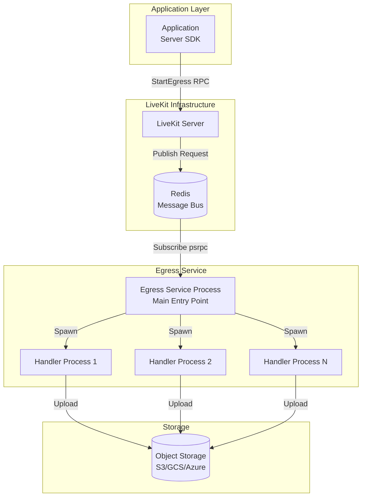
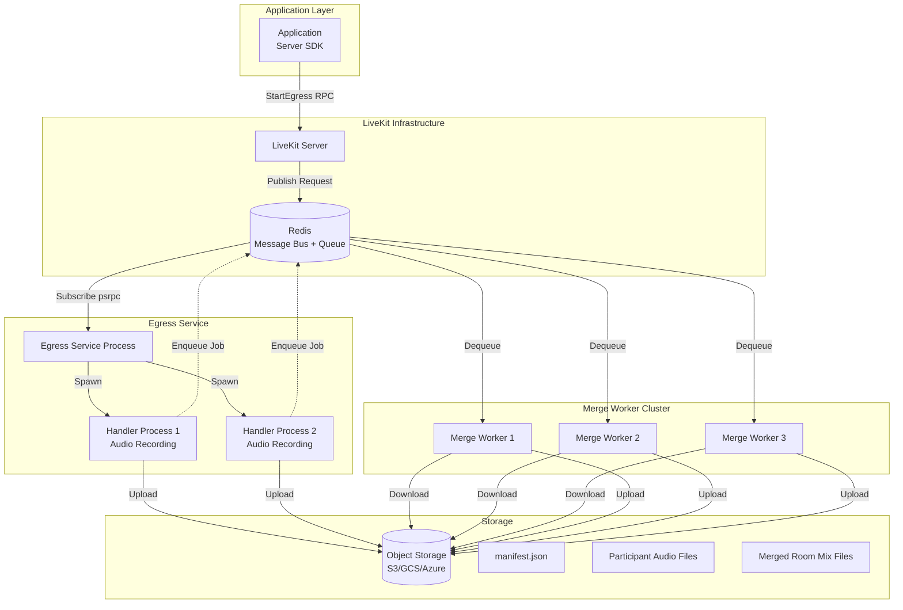
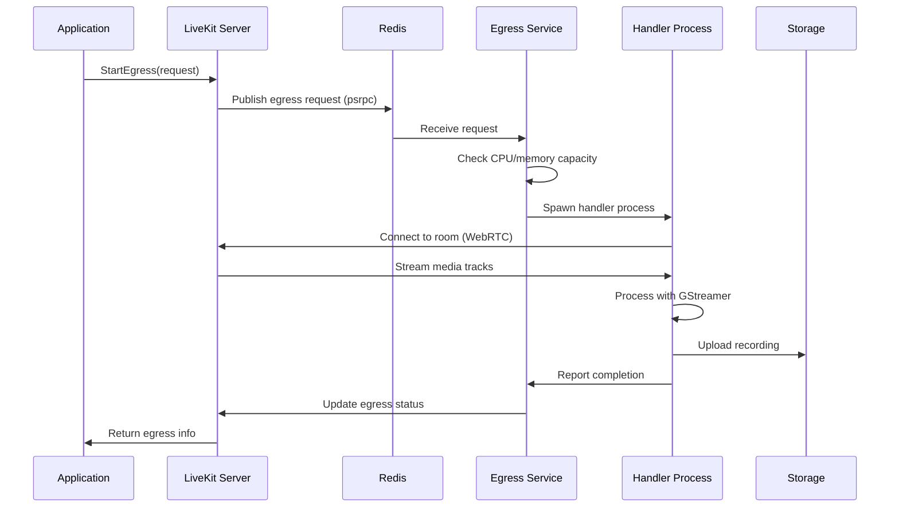
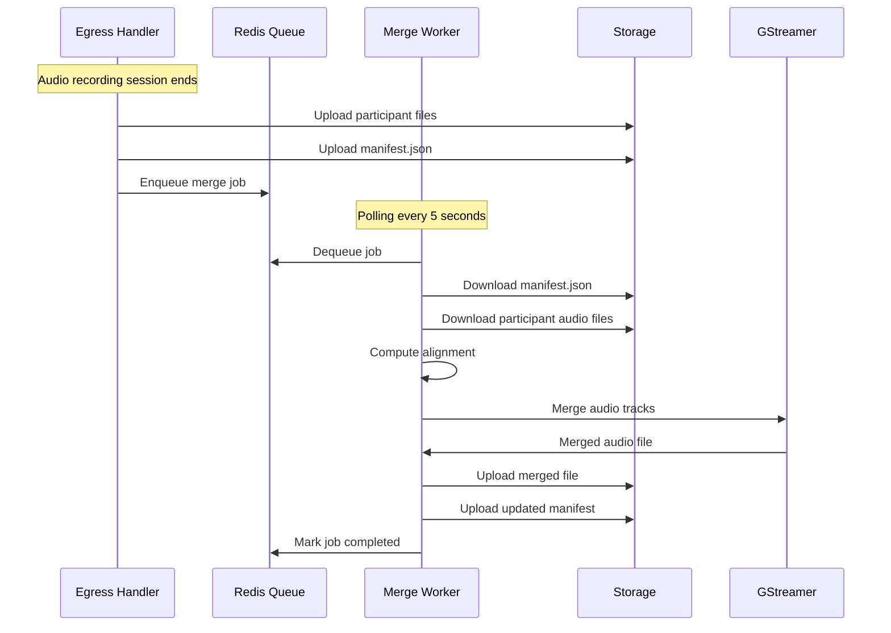
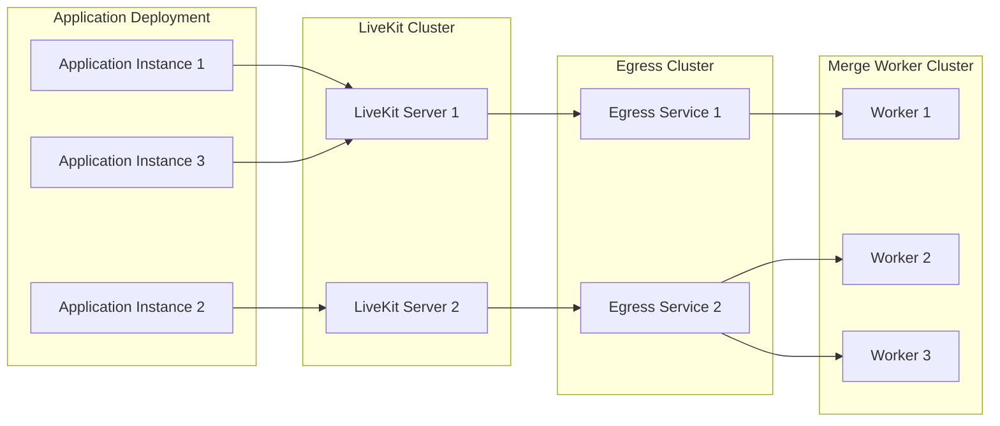

# Egress Deployment Comparison: Current vs. Merge Worker

This document compares the current Egress deployment model with the new Merge Worker component, explaining how they interact with LiveKit server and applications.

## Current Egress Deployment Model

### Architecture Overview



### Deployment Characteristics

1. **Single Container/Process Model**
   - One Docker container runs the egress service
   - Service listens for requests via Redis (psrpc)
   - Each recording request spawns a separate handler process

2. **Communication Flow**
   - **Application → LiveKit Server**: Application uses Server SDK to call `StartEgress()`
   - **LiveKit Server → Egress**: Server publishes egress request via Redis (psrpc)
   - **Egress Service → Handler**: Service spawns handler process with request config
   - **Handler → Storage**: Handler processes media and uploads to storage

3. **Process Model**
   ```
   Egress Service (Main Process)
   ├── Monitors Redis for requests
   ├── Manages CPU/memory resources
   ├── Spawns handler processes
   └── Handler Process 1 (Recording Session 1)
       ├── Connects to LiveKit room
       ├── Processes media via GStreamer
       └── Uploads to storage
   └── Handler Process 2 (Recording Session 2)
       └── ...
   ```

4. **Scaling Model**
   - Horizontal scaling: Deploy multiple egress service instances
   - Each instance connects to the same Redis
   - LiveKit server distributes requests across available instances
   - CPU/memory monitoring prevents over-allocation

### Configuration

```yaml
# Egress Service Config
api_key: <livekit-api-key>
api_secret: <livekit-api-secret>
ws_url: wss://your-livekit-server.com
redis:
  address: redis:6379
  password: <redis-password>

# Resource limits
cpu_cost:
  room_composite_cpu_cost: 4.0
  track_composite_cpu_cost: 2.0
  track_cpu_cost: 1.0

# Storage
storage:
  s3:
    access_key: <aws-key>
    secret: <aws-secret>
    region: us-east-1
    bucket: recordings-bucket
```

### Docker Deployment

```bash
docker run -d \
  --name egress \
  -e EGRESS_CONFIG_FILE=/config/config.yaml \
  -v /path/to/config:/config \
  -v /tmp/egress:/tmp \
  livekit/egress
```

## New Merge Worker Deployment Model

### Architecture Overview



### Deployment Characteristics

1. **Separate Service Model**
   - Merge workers run as independent processes/containers
   - Completely decoupled from egress service
   - Can be scaled independently based on merge job volume

2. **Communication Flow**
   - **Egress Handler → Redis Queue**: When audio recording ends, handler enqueues merge job
   - **Merge Worker → Redis Queue**: Workers poll queue for jobs (every 5 seconds)
   - **Merge Worker → Storage**: Downloads participant files and manifest
   - **Merge Worker → Storage**: Uploads merged files and updated manifest

3. **Process Model**
   ```
   Egress Service (Main Process)
   └── Handler Process (Audio Recording)
       ├── Records participant audio tracks
       ├── Uploads individual files
       └── Enqueues merge job to Redis

   Merge Worker 1 (Independent Process)
   ├── Polls Redis queue
   ├── Downloads manifest and audio files
   ├── Merges tracks using GStreamer
   └── Uploads merged files

   Merge Worker 2 (Independent Process)
   └── ...
   ```

4. **Scaling Model**
   - **Egress Service**: Scale based on concurrent recording sessions
   - **Merge Workers**: Scale based on merge job queue depth
   - Workers are stateless and can be added/removed dynamically
   - Jobs are idempotent and can be retried

### Configuration

```yaml
# Merge Worker Config (same Redis and Storage as Egress)
api_key: <livekit-api-key>  # Optional, for metrics
api_secret: <livekit-api-secret>  # Optional
redis:
  address: redis:6379
  password: <redis-password>

storage:
  s3:
    access_key: <aws-key>
    secret: <aws-secret>
    region: us-east-1
    bucket: recordings-bucket
```

### Docker Deployment

```bash
# Deploy Merge Worker
docker run -d \
  --name merge-worker-1 \
  -e EGRESS_CONFIG_FILE=/config/config.yaml \
  -e MERGE_WORKER_ID=worker-1 \
  -e MERGE_TMP_DIR=/tmp/merge \
  -v /path/to/config:/config \
  -v /tmp/merge:/tmp/merge \
  livekit/egress merge-worker

# Deploy additional workers for scaling
docker run -d \
  --name merge-worker-2 \
  -e EGRESS_CONFIG_FILE=/config/config.yaml \
  -e MERGE_WORKER_ID=worker-2 \
  -e MERGE_TMP_DIR=/tmp/merge \
  -v /path/to/config:/config \
  -v /tmp/merge:/tmp/merge \
  livekit/egress merge-worker
```

## Comparison Table

| Aspect | Current Egress | Merge Worker |
|--------|---------------|--------------|
| **Deployment** | Single container with service + handlers | Separate container/process |
| **Purpose** | Real-time recording and processing | Offline audio merging |
| **Communication** | Redis (psrpc) for requests | Redis queue for jobs |
| **Scaling** | Scale based on concurrent sessions | Scale based on job queue depth |
| **Resource Usage** | CPU-intensive during recording | CPU-intensive during merge |
| **State** | Stateful (active recordings) | Stateless (processes jobs) |
| **Dependencies** | LiveKit server connection required | Only Redis and Storage required |
| **Failure Handling** | Request fails if handler crashes | Jobs can be retried (max 3 attempts) |
| **Storage Access** | Write-only (uploads recordings) | Read-write (downloads + uploads) |

## Interaction with LiveKit Server

### Current Egress Flow



### Merge Worker Flow (No Direct LiveKit Interaction)



**Key Difference**: Merge workers do **not** interact with LiveKit server directly. They only:
1. Read from Redis queue (jobs)
2. Read/write to Storage (files)
3. Process locally (GStreamer merge)

## Interaction with Application

### Application Integration

Applications interact with the system in two ways:

#### 1. Starting Recordings (via LiveKit Server)

```go
// Application code
import "github.com/livekit/server-sdk-go"

client := lksdk.NewEgressClient(wsURL, apiKey, apiSecret)

// Start audio recording
req := &livekit.StartEgressRequest{
    RoomName: "my-room",
    Request: &livekit.EgressRequest{
        Request: &livekit.EgressRequest_AudioRecording{
            AudioRecording: &livekit.AudioRecordingRequest{
                RoomName: "my-room",
                SessionId: "session-123",
                IsolatedTracks: true,
                FinalRoomMix: true,  // Enable offline merge
                Formats: []livekit.AudioRecordingFormat{
                    livekit.AudioRecordingFormat_OGG_OPUS,
                },
                SampleRate: 48000,
            },
        },
    },
}

info, err := client.StartEgress(context.Background(), req)
```

#### 2. Retrieving Results (from Storage)

```go
// After merge completes, application reads manifest
manifest, err := storage.Download("room-name/session-id/manifest.json")

// Manifest contains:
// - Individual participant files
// - Merged room mix files (if FinalRoomMix enabled)
// - Metadata (timestamps, checksums, etc.)
```

### Application Deployment Considerations



**Application Perspective**:
- Applications only interact with LiveKit Server (via Server SDK)
- No direct interaction with Egress or Merge Workers
- Results are available in Storage after processing completes
- Applications poll Storage or use webhooks to detect completion

## Deployment Scenarios

### Scenario 1: Small Scale (< 10 concurrent recordings)

**Current Egress**: 1-2 instances
**Merge Workers**: 1 instance (can handle merge jobs asynchronously)

```yaml
# Kubernetes example
egress:
  replicas: 2
merge-worker:
  replicas: 1
```

### Scenario 2: Medium Scale (10-50 concurrent recordings)

**Current Egress**: 3-5 instances
**Merge Workers**: 2-3 instances

```yaml
egress:
  replicas: 5
merge-worker:
  replicas: 3
```

### Scenario 3: Large Scale (50+ concurrent recordings)

**Current Egress**: Auto-scaling based on CPU/memory
**Merge Workers**: Auto-scaling based on queue depth

```yaml
egress:
  minReplicas: 5
  maxReplicas: 20
  targetCPUUtilization: 70

merge-worker:
  minReplicas: 3
  maxReplicas: 10
  # Custom metric: queue depth
  targetQueueDepth: 10
```

## Kubernetes Deployment Examples

### Egress Service Deployment

```yaml
apiVersion: apps/v1
kind: Deployment
metadata:
  name: egress
spec:
  replicas: 3
  selector:
    matchLabels:
      app: egress
  template:
    metadata:
      labels:
        app: egress
    spec:
      containers:
      - name: egress
        image: livekit/egress:latest
        env:
        - name: EGRESS_CONFIG_FILE
          value: /config/config.yaml
        volumeMounts:
        - name: config
          mountPath: /config
        resources:
          requests:
            cpu: "2"
            memory: "4Gi"
          limits:
            cpu: "4"
            memory: "8Gi"
      volumes:
      - name: config
        configMap:
          name: egress-config
---
apiVersion: v1
kind: Service
metadata:
  name: egress
spec:
  selector:
    app: egress
  ports:
  - port: 8080
    name: health
```

### Merge Worker Deployment

```yaml
apiVersion: apps/v1
kind: Deployment
metadata:
  name: merge-worker
spec:
  replicas: 5
  selector:
    matchLabels:
      app: merge-worker
  template:
    metadata:
      labels:
        app: merge-worker
    spec:
      containers:
      - name: merge-worker
        image: livekit/egress:latest
        command: ["egress", "merge-worker"]
        env:
        - name: EGRESS_CONFIG_FILE
          value: /config/config.yaml
        - name: MERGE_WORKER_ID
          valueFrom:
            fieldRef:
              fieldPath: metadata.name
        - name: MERGE_TMP_DIR
          value: /tmp/merge
        volumeMounts:
        - name: config
          mountPath: /config
        - name: tmp
          mountPath: /tmp/merge
        resources:
          requests:
            cpu: "1"
            memory: "2Gi"
          limits:
            cpu: "2"
            memory: "4Gi"
      volumes:
      - name: config
        configMap:
          name: egress-config
      - name: tmp
        emptyDir: {}
```

### Auto-Scaling Configuration

```yaml
# Horizontal Pod Autoscaler for Merge Workers
apiVersion: autoscaling/v2
kind: HorizontalPodAutoscaler
metadata:
  name: merge-worker-hpa
spec:
  scaleTargetRef:
    apiVersion: apps/v1
    kind: Deployment
    name: merge-worker
  minReplicas: 3
  maxReplicas: 20
  metrics:
  - type: Resource
    resource:
      name: cpu
      target:
        type: Utilization
        averageUtilization: 70
  # Custom metric: Redis queue length
  - type: External
    external:
      metric:
        name: redis_queue_length
      target:
        type: AverageValue
        averageValue: "10"
```

## Monitoring and Observability

### Egress Service Metrics

- Active recording sessions
- CPU/memory utilization
- Request acceptance/rejection rate
- Handler process count
- Upload success/failure rate

### Merge Worker Metrics

- Queue depth (jobs pending)
- Jobs processed per second
- Job success/failure rate
- Average processing time
- Storage download/upload throughput

### Redis Queue Monitoring

```bash
# Check queue length
redis-cli LLEN livekit:egress:merge:queue

# Check job status
redis-cli GET livekit:egress:merge:status:<job-id>

# Monitor queue operations
redis-cli MONITOR | grep "livekit:egress:merge"
```

## Best Practices

### 1. Resource Allocation

- **Egress Service**: Allocate CPU/memory based on concurrent session capacity
- **Merge Workers**: Allocate based on merge job processing rate
- **Storage**: Ensure sufficient bandwidth for concurrent uploads/downloads

### 2. Scaling Strategy

- **Egress**: Scale based on request acceptance rate and CPU utilization
- **Merge Workers**: Scale based on queue depth and processing latency
- Use separate auto-scaling policies for each service

### 3. Failure Handling

- **Egress**: Monitor handler process failures and restart service if needed
- **Merge Workers**: Jobs automatically retry (max 3 times) on failure
- Implement dead-letter queue for permanently failed jobs

### 4. Storage Configuration

- Use same storage backend for both Egress and Merge Workers
- Configure appropriate IAM roles/permissions
- Enable versioning for manifest files (important for debugging)

### 5. Network Configuration

- Egress service needs connectivity to LiveKit server (WebRTC)
- Merge workers only need Redis and Storage connectivity
- Consider network policies to restrict unnecessary access

## Summary

The Merge Worker introduces a **decoupled, scalable architecture** for offline audio processing:

1. **Separation of Concerns**: Real-time recording (Egress) vs. offline processing (Merge Worker)
2. **Independent Scaling**: Each service scales based on its own metrics
3. **Fault Tolerance**: Merge jobs can be retried without affecting active recordings
4. **Resource Efficiency**: Merge workers only consume resources when processing jobs
5. **Simplified Operations**: Workers are stateless and can be deployed/updated independently

This architecture allows organizations to:
- Scale recording capacity independently from merge processing capacity
- Handle merge jobs asynchronously without blocking recording sessions
- Deploy merge workers in different regions/zones for cost optimization
- Implement different resource allocation strategies for each service type
