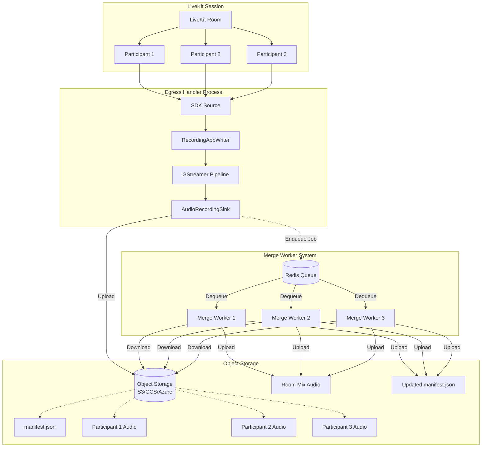
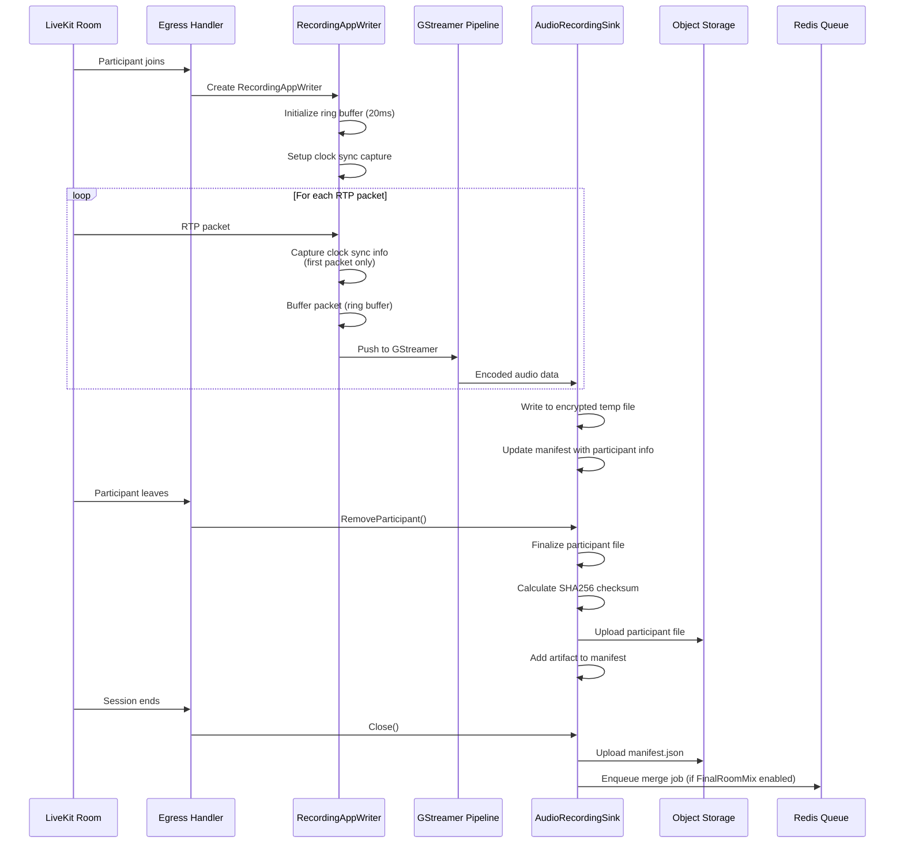
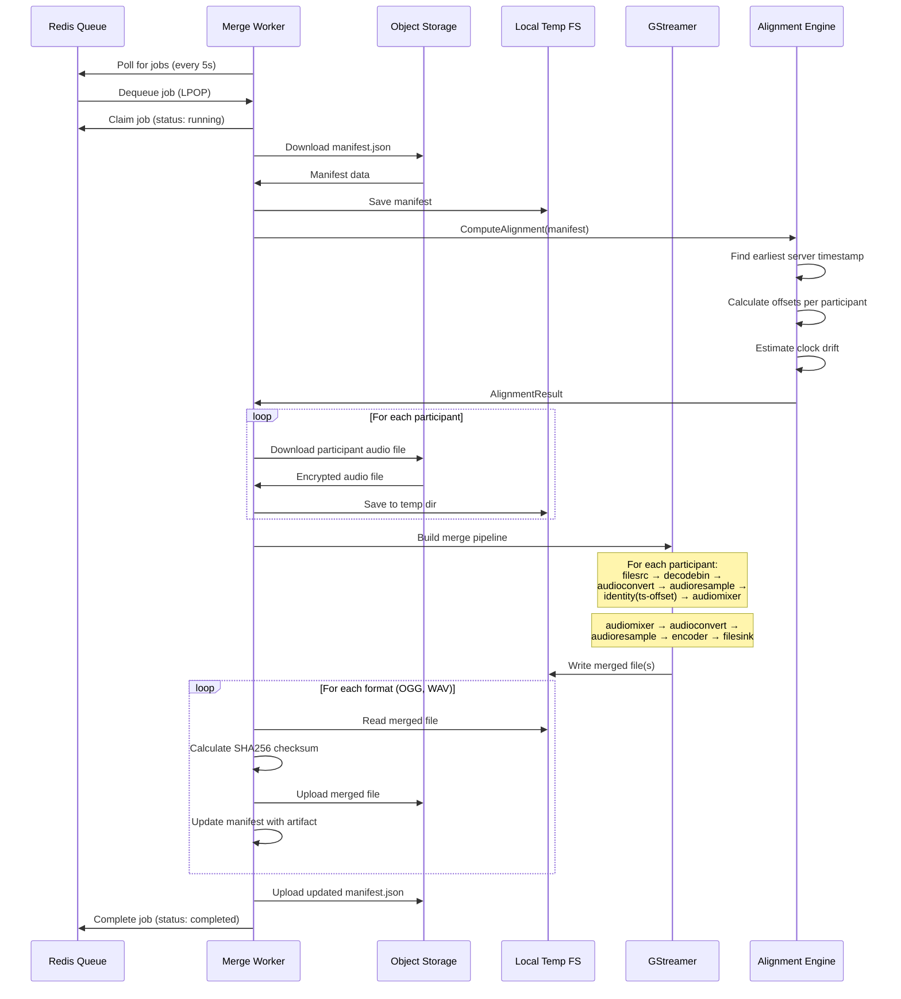
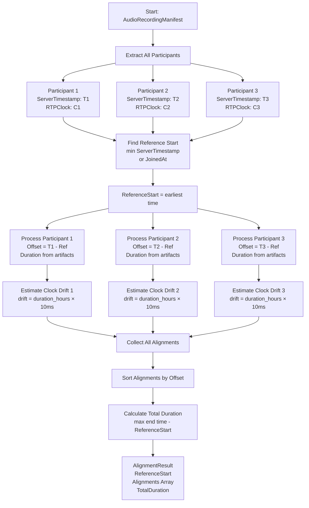
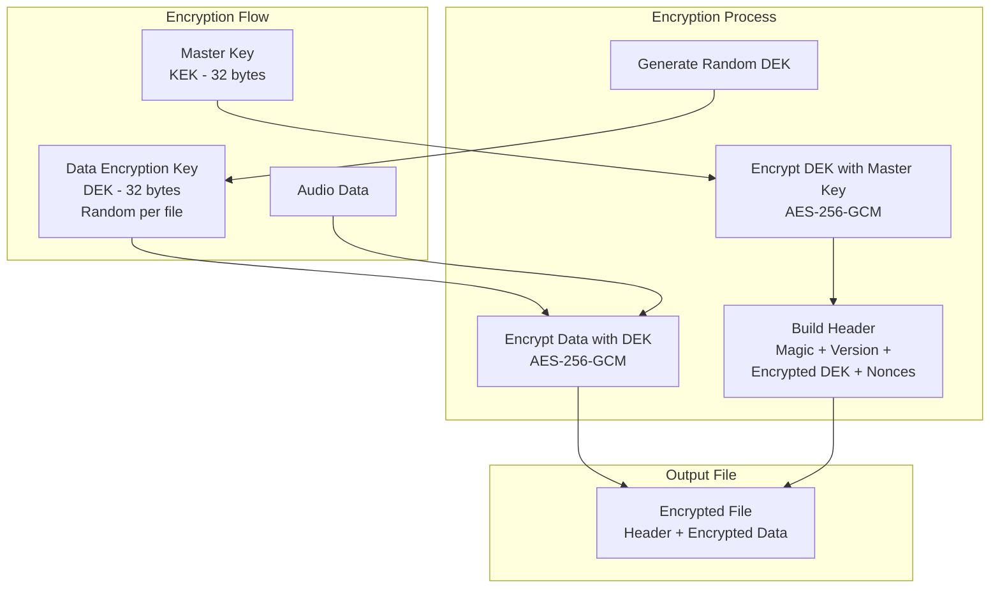
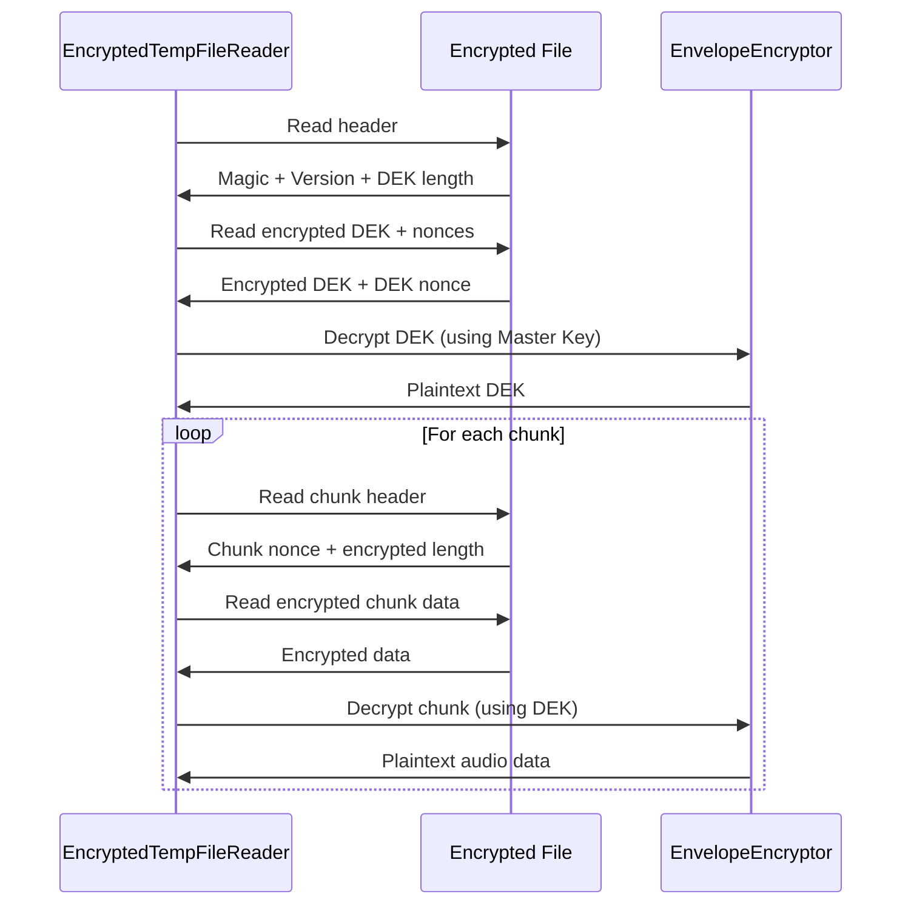
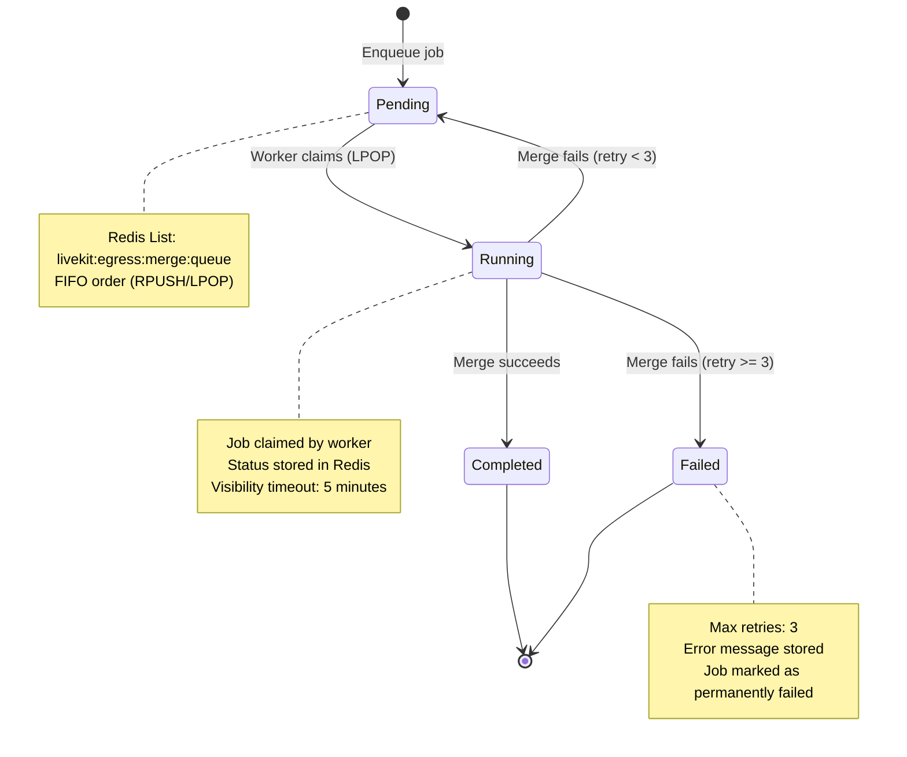
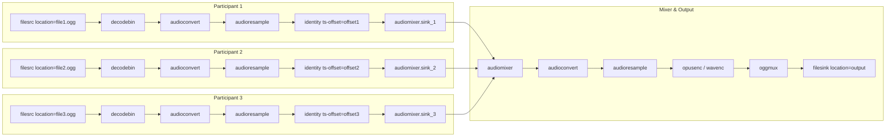
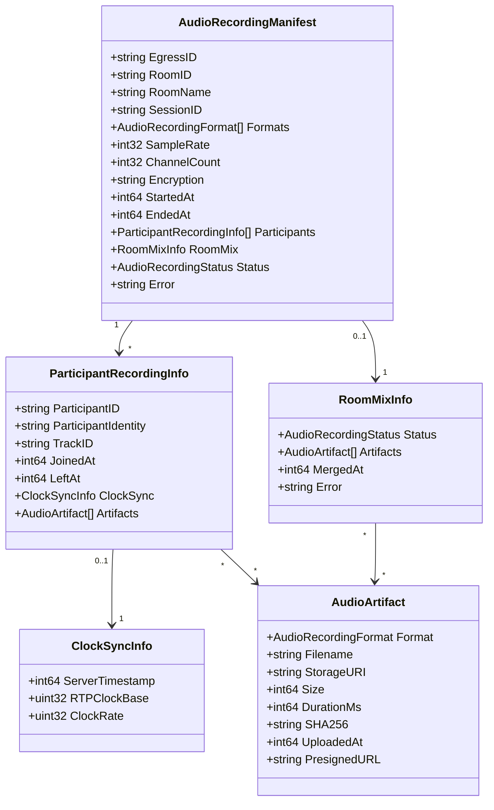
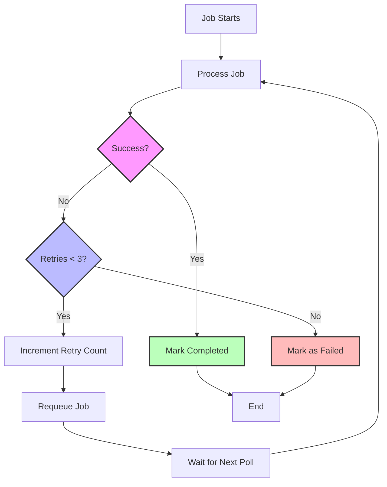

# Merge Worker Architecture Documentation

## Overview

This commit (`de01a772891a200c64b2e5ce5125fd6be1f4c357`) introduces an **offline audio merge worker system** for LiveKit Egress. The system enables recording individual participant audio tracks during a LiveKit session, then merging them into a single mixed audio file after the session ends.

## Key Components

### 1. Audio Recording Pipeline
- Records individual participant audio tracks in real-time
- Captures clock synchronization information for offline alignment
- Supports encryption (AES-256-GCM envelope encryption)
- Generates manifest files with metadata

### 2. Merge Worker
- Processes merge jobs from a Redis queue
- Downloads participant audio files
- Aligns tracks using clock sync information
- Merges tracks using GStreamer
- Uploads merged files and updates manifest

### 3. Encryption System
- Envelope encryption (AES-256-GCM)
- Per-file Data Encryption Keys (DEK)
- Master Key Encryption (KEK) for DEK protection
- Streaming encryption support for large files

### 4. Queue System
- Redis-based job queue
- Job status tracking
- Automatic retry mechanism (max 3 retries)
- Worker claim/visibility timeout

## System Architecture



## Recording Flow



## Merge Worker Flow



## Alignment Algorithm

The alignment algorithm ensures that participant audio tracks are properly synchronized when merged, accounting for:
- Different join times
- Clock drift between participants
- RTP timestamp differences



### Alignment Details

1. **Reference Point Selection**: Uses the earliest server timestamp as the reference point (time 0)
2. **Offset Calculation**: For each participant, calculates offset = `participant_start_time - reference_start_time`
3. **Clock Drift Estimation**: Estimates potential clock drift using formula: `drift = (duration_hours × 10ms)`
   - Target: <20ms drift over 60 minutes
   - Conservative estimate: 10ms per hour
4. **GStreamer Integration**: Offsets are applied using `identity` element's `ts-offset` property

## Encryption System

The system supports envelope encryption for local storage:



### Encryption File Format

```
[Header Section]
├── Magic: "LKAE" (4 bytes)
├── Version: 1 (1 byte)
├── Encrypted DEK Length: uint16 (2 bytes)
├── Encrypted DEK: variable length
├── DEK Nonce: 12 bytes
└── Base Data Nonce: 12 bytes

[Data Section - Chunked]
├── Chunk 1
│   ├── Chunk Nonce: 12 bytes (base nonce XOR counter)
│   ├── Encrypted Length: uint32 (4 bytes)
│   └── Encrypted Data: variable length
├── Chunk 2
│   └── ...
└── ...
```

### Decryption Flow



## Queue System

The merge job queue is implemented using Redis:



### Queue Operations

1. **Enqueue**: `RPUSH livekit:egress:merge:queue <job_json>`
2. **Dequeue**: `LPOP livekit:egress:merge:queue` (FIFO)
3. **Status Tracking**: `SET livekit:egress:merge:status:<job_id> <job_json> EX 86400`
4. **Requeue**: `LPUSH livekit:egress:merge:queue <job_json>` (for retries)

## GStreamer Merge Pipeline

The merge pipeline uses GStreamer's `audiomixer` element:



### Pipeline Command Example

```bash
gst-launch-1.0 -e \
  filesrc location=participant1.ogg ! decodebin ! audioconvert ! audioresample ! \
  audio/x-raw,rate=48000,channels=2 ! identity ts-offset=0 ! audiomixer.sink_1 \
  filesrc location=participant2.ogg ! decodebin ! audioconvert ! audioresample ! \
  audio/x-raw,rate=48000,channels=2 ! identity ts-offset=500000000 ! audiomixer.sink_2 \
  audiomixer name=audiomixer ! audioconvert ! audioresample ! \
  audio/x-raw,rate=48000,channels=2,format=S16LE ! opusenc ! oggmux ! \
  filesink location=room_mix.ogg
```

## Manifest Structure

The manifest file (`manifest.json`) contains all metadata about the recording session:



## File Structure

### Storage Path Structure

```
{room_name}/{session_id}/
├── manifest.json
├── participants/
│   ├── participant1_identity_participant1_20260125T120000.ogg
│   ├── participant2_identity_participant2_20260125T120000.ogg
│   └── participant3_identity_participant3_20260125T120000.ogg
└── room_mix_20260125T120000.ogg
```

## Error Handling & Retry Logic



## Configuration

### Merge Worker Configuration

```yaml
# Command line flags
--worker-id: Unique worker identifier
--tmp-dir: Temporary directory for merge operations
--config: Path to egress config file
--config-body: Config YAML as string
```

### Audio Recording Configuration

```yaml
audio_recording:
  room_name: "my-room"
  session_id: "session-123"
  isolated_tracks: true  # Record each participant separately
  final_room_mix: true   # Enable offline merge
  formats:
    - ogg_opus
    - wav_pcm
  sample_rate: 48000
  encryption:
    mode: aes_256
    master_key: <base64-encoded-key>
  storage:
    s3:
      access_key: "..."
      secret_key: "..."
      region: "us-east-1"
      bucket: "my-bucket"
```

## Performance Considerations

1. **Memory Efficiency**: 
   - Recording uses 20ms ring buffer (vs 500ms jitter buffer)
   - Streaming encryption with 64KB chunks
   - Temporary files cleaned up after merge

2. **Alignment Accuracy**:
   - Target: <20ms drift over 60 minutes
   - Uses server timestamps as primary reference
   - RTP clock info for fine-tuning

3. **Scalability**:
   - Multiple workers can process jobs in parallel
   - Redis queue supports horizontal scaling
   - Jobs are stateless and can be retried

4. **Storage Optimization**:
   - Participant files uploaded immediately when participant leaves
   - Manifest updated incrementally
   - Merged files only created if `final_room_mix: true`

## Security Features

1. **Encryption**:
   - AES-256-GCM envelope encryption
   - Per-file DEK (Data Encryption Key)
   - Master Key (KEK) never stored with data
   - Support for S3 SSE, GCS CMEK

2. **Integrity**:
   - SHA256 checksums for all artifacts
   - Verified on upload and download

3. **Access Control**:
   - Storage credentials managed separately
   - Presigned URLs for temporary access

## Testing

The commit includes comprehensive tests:
- `pkg/merge/merge_test.go`: Merge worker tests
- `pkg/encryption/encryption_test.go`: Encryption tests

Run tests with:
```bash
go test ./pkg/merge/...
go test ./pkg/encryption/...
```

## Summary

This commit introduces a complete offline audio merging system that:

1. **Records** individual participant audio tracks with clock sync information
2. **Stores** encrypted audio files and metadata in object storage
3. **Queues** merge jobs in Redis when sessions end
4. **Processes** merge jobs asynchronously using worker processes
5. **Aligns** tracks using server timestamps and RTP clock information
6. **Merges** tracks using GStreamer's audiomixer
7. **Uploads** merged files and updates manifests

The system is designed for scalability, reliability, and accuracy, with support for encryption, retry logic, and horizontal scaling of workers.
